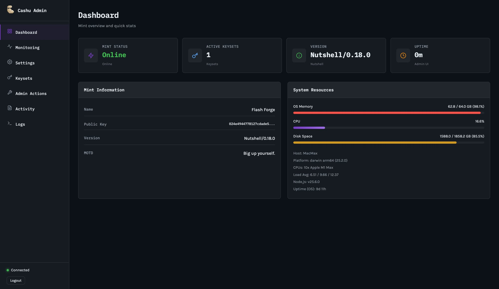

# Cashu Nutshell Admin UI

A web-based administration dashboard for [Cashu Nutshell](https://github.com/cashubtc/nutshell) mints. Monitor activity, manage settings, rotate keysets, and perform admin operations from a modern dark-themed interface.



## Features

- **Dashboard** — Mint status, version, active keysets, uptime, OS memory/CPU/disk usage, load average, host info
- **Database statistics** — Direct read-only SQLite inspection: entry counts for mint_quotes, melt_quotes, proofs, outputs; state breakdowns; trailing 24h/1h request volumes
- **Real-time monitoring** — WebSocket-powered live metrics, request tracking, operation counters
- **Prometheus metrics** — `/metrics` endpoint for Prometheus + Grafana integration (with DB entry count gauges)
- **Settings management** — Configure mint info, limits, fees, and contact details via tabbed UI (pre-populated from live mint)
- **Keyset management** — View active keysets, trigger key rotation with custom parameters
- **Admin actions** — Free mint (issue ecash without payment), quote state overrides, cache clearing
- **Activity log** — Filterable transaction history (mint/melt/swap/checkstate)
- **Live logs** — Streaming server logs with level/source filtering and auto-scroll
- **Authentication** — HTTP Basic Auth with configurable credentials
- **Docker ready** — Dockerfile and docker-compose.yml included

## Quick Start

```bash
git clone <repo-url> cashu-admin-ui
cd cashu-admin-ui
cp .env.example .env    # edit as needed
npm install
npm start
```

Open `http://localhost:3339` — login with `admin` / `admin123` (default).

## Docker

### Standalone

```bash
docker build -t cashu-admin-ui .
docker run -d -p 3339:3339 \
  -e MINT_URL=http://your-mint:3338 \
  -e ADMIN_USER=admin \
  -e ADMIN_PASS=changeme \
  cashu-admin-ui
```

### With Nutshell mint (docker-compose)

```bash
docker-compose up -d
```

This starts both the admin UI on port `3339` and a Nutshell mint (FakeWallet backend) on port `3338`. To connect to your existing mint, update `MINT_URL` in `docker-compose.yml`.

## Configuration

| Variable | Default | Description |
|---|---|---|
| `PORT` | `3339` | Admin UI server port |
| `MINT_URL` | `http://127.0.0.1:3338` | Nutshell mint API URL |
| `MINT_GRPC_PORT` | `8086` | Mint gRPC management port (reserved for future use) |
| `ADMIN_USER` | `admin` | Basic auth username |
| `ADMIN_PASS` | `admin123` | Basic auth password |
| `AUTH_TYPE` | `basic` | Auth mode: `basic`, `token`, or `none` |
| `MINT_DB_PATH` | _(empty)_ | Path to Nutshell's `cashu.db` SQLite file. Enables database entry count monitoring. Common: `~/.cashu/mint/data/cashu.db` (default install) or `./data/cashu.db` (Docker). Read-only access — admin UI never writes to the DB. |

## Architecture

```
┌──────────────┐       ┌──────────────────┐       ┌──────────────┐
│   Browser    │◄─────►│  Express Server   │◄─────►│  Nutshell    │
│  (SPA)       │  WS   │  (server.js)      │ HTTP  │  Mint API    │
│              │  HTTP  │                   │       │  /v1/*       │
└──────────────┘       └──────────────────┘       └──────────────┘
```

- **Server**: Express.js with HTTP + WebSocket on a single port. Acts as a reverse proxy to the Nutshell mint's `/v1/*` endpoints and exposes admin-specific `/api/admin/*` routes.
- **Frontend**: Vanilla HTML/CSS/JS single-page app in `public/`. No build step.
- **WebSocket**: Pushes live stats (memory, uptime, requests) every 5 seconds and streams log entries in real time.
- **Auth**: HTTP Basic Auth middleware on all `/api/*` routes. Credentials stored in browser localStorage (base64).

## Pages

| Page | Description |
|---|---|
| **Dashboard** | Mint status, version, keyset count, uptime, DB entry counts, memory/CPU/disk bars, mint info card |
| **Monitoring** | Live request counters (mint/melt/swap), recent requests table, simulate activity |
| **Settings** | Tabbed forms: Mint Info, Limits, Fees, Contact/MOTD (pre-populated from live mint) |
| **Keysets** | Active keysets table, key rotation form (unit, max order, input fee) |
| **Admin Actions** | Key rotation trigger, free mint modal, quote state management, cache clearing |
| **Activity** | Filterable activity log with timestamps, types, amounts, IPs |
| **Database** | Direct SQLite read: entry counts per table, quote state breakdowns (UNPAID/PAID/ISSUED/EXPIRED), trailing 24h/1h request volume |
| **Logs** | Streaming log viewer with level/source filters, auto-scroll, clear |

## API Endpoints

All endpoints require authentication (unless `AUTH_TYPE=none`).

### Mint Proxy

| Method | Path | Description |
|---|---|---|
| GET | `/api/mint/info` | Proxy to `/v1/info` |
| GET | `/api/mint/keys` | Proxy to `/v1/keys` |
| GET | `/api/mint/keysets` | Proxy to `/v1/keysets` |

### Admin

| Method | Path | Description |
|---|---|---|
| GET | `/api/admin/dashboard` | Aggregated dashboard data (info + keys + keysets + config) |
| GET | `/api/admin/system` | Node.js process stats (uptime, memory, CPU) |
| GET | `/api/admin/monitoring` | Request monitoring data |
| POST | `/api/admin/monitoring/clear` | Reset monitoring counters |
| GET | `/api/admin/settings` | Current mint settings from environment |
| POST | `/api/admin/settings/info` | Update mint name, description, icon, TOS |
| POST | `/api/admin/settings/motd` | Update message of the day |
| POST | `/api/admin/settings/contact` | Add/update contact method |
| POST | `/api/admin/settings/url` | Add/remove mint URL |
| POST | `/api/admin/settings/limits` | Update mint/melt/balance limits and rate limits |
| POST | `/api/admin/settings/fees` | Update fee percentage and reserve minimum |
| POST | `/api/admin/keyset/rotate` | Trigger keyset rotation |
| POST | `/api/admin/mint/free` | Issue ecash without payment |
| POST | `/api/admin/quote/mint` | Override mint quote state |
| POST | `/api/admin/quote/melt` | Override melt quote state |
| GET | `/api/admin/db/stats` | Database entry counts from Nutshell's SQLite (requires `MINT_DB_PATH`) |
| GET | `/api/admin/activity` | Recent activity (filterable by type) |
| POST | `/api/admin/activity/simulate` | Generate simulated activity for testing |
| GET | `/api/admin/logs` | Fetch log entries (filterable by level, source, since) |
| POST | `/api/admin/logs/clear` | Clear log buffer |

### WebSocket

Connect to `ws://localhost:3339`. Receives:
- `{ type: "connected" }` — on connection
- `{ type: "stats", data: {...} }` — every 5 seconds (memory, uptime, recent requests)
- `{ type: "log", data: {...} }` — real-time log entries

## Prometheus Metrics

The admin UI exposes a `/metrics` endpoint in Prometheus exposition format, enabling integration with Prometheus + Grafana monitoring stacks.

```bash
curl http://localhost:3339/metrics
```

Exported metrics include:

| Metric | Type | Description |
|---|---|---|
| `cashu_mint_up` | gauge | Mint reachability (1=up, 0=down) |
| `cashu_mint_active_keysets` | gauge | Number of active keysets |
| `cashu_mint_requests_total` | counter | Total observed mint operations (by type) |
| `cashu_admin_os_disk_free_bytes` | gauge | Free disk space |
| `cashu_admin_os_disk_total_bytes` | gauge | Total disk space |
| `cashu_admin_os_load_avg` | gauge | OS load average (1m/5m/15m) |
| `cashu_mint_db_entries_total` | gauge | DB table row counts (label: `table`) |
| `cashu_mint_db_quotes_by_state` | gauge | Quote counts by type and state (labels: `quote_type`, `state`) |
| `cashu_admin_process_*` | various | Node.js process metrics (CPU, memory, event loop) |

The `/metrics` endpoint does not require authentication (standard for Prometheus scraping). Add it to your `prometheus.yml`:

```yaml
scrape_configs:
  - job_name: 'cashu-admin'
    static_configs:
      - targets: ['localhost:3339']
```

## Security

- **Change default credentials** before deploying. Set `ADMIN_USER` and `ADMIN_PASS` in your environment.
- **Run behind a reverse proxy** (nginx, Caddy) with TLS in production.
- Set `AUTH_TYPE=none` only for local development.
- The admin UI should not be exposed to the public internet without proper access controls.

## Development

The project has no build step. Edit files directly:

- `server.js` — Express server, API routes, WebSocket handler
- `public/index.html` — All page markup (SPA with show/hide sections)
- `public/styles.css` — Dark theme, responsive layout, all component styles
- `public/app.js` — `CashuAdmin` class handling auth, API calls, WebSocket, UI updates

```bash
npm start   # runs node server.js
```

Changes to `public/*` are served immediately. Server changes require restart.

## License

MIT

## Contributing

Contributions welcome. Open an issue or submit a pull request.
